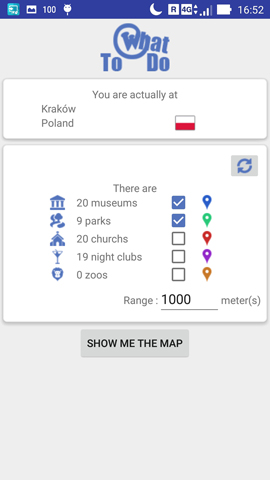
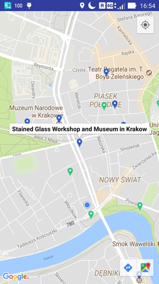
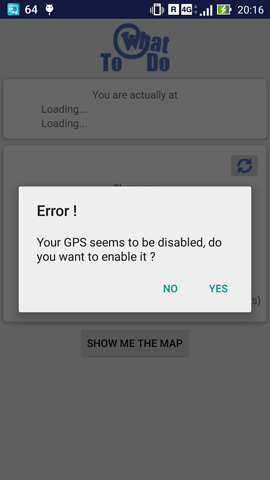

# Block of elective items

## WhatToDo  

## Information  
  * Date: Winter 2017-2018  
  * School: AGH  
  * Author: [Pierre RAINERO](pierre.rainero@hotmail.fr)  

## API used
  * Google MAPS
  * Google PLACES  
_Minimal version_ : 21 (Android 5.0 - Lollipop)

## Description
This application aims to find activities according to the distance with the user and the kind places that interest him :
   
The location is calculed according to the "fine" method, which means that the network and gps are used (various checks are made to avoid problems) :
 
  
## How to install
Use the `apk` file or import the code in `Android Studio`.